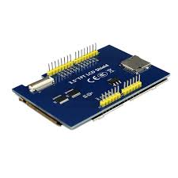

# 3-5inch_ili9481_tft_atmega328
A bare-bones implementation to get going quickly. Very specifically only for driving a 3.5" ILI9481-based TFT display with an ATMega328 (no Arduino/Adafruit/other libs or bootloader required), but should work for others with some modifications. Information taken directly from ILI9481 datasheet.

**This is NOT an Arduino project!** It is written in C to be compiled directly into a `.hex` file by gcc-avr. This is not to say it's *incompatible* with Arduino, it's just that the Arduino libs are not necessary.

With this simple implementation you can:
- initialize the display and blank the screen
- draw and fill basic shapes (lines, rectangles, etc)
- write stuff in a basic font using primitive text tools

### \*\* Don't dowload the files yet \*\*
This has not even reached WIP stage, it's just a test commit. *This notice will be removed once things change.*

### 3.5" TFT Display (no touch) for Arduino UNO

This is a fantastic little display (320x480), pretty easy to use and dirt cheap. Here's a picture:

# So that you know

I love my wife!

